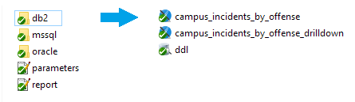
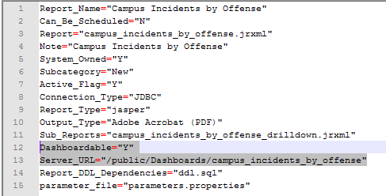

# Dashboardable-Reports Deployment

The deployment process for dashboardable-reports is similar to the process for traditional base reports. There are a few key differences, outlined below.

## Package Format

The package for a dashboardable report has the same structure as a base report.



The primary difference is found in the report.properties file. Here we add two new properties:



 1. ```Dashboardable="Y"```

	This property marks the report as dashboardable. It will be discoverable in *My Report Profiles* when you select the 'Dashboardable' radio button.

 2. ```Server_URL="/public/Dashboards/myReportName"```

	This is the path to the report on JasperReports Server. Take note that a file extension is not used. You can choose any **public** path you wish; if applicable, make sure that your drilldown path agrees with the path you've chosen.

## Deployment

The usual process for deploying reports applies here.

1. Create an archive of the package's files.

2. Upload the archive to *Jasper Custom Reports.*

3. Distribute the dashboard to users.
